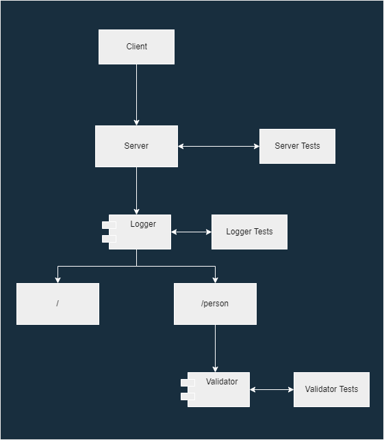

# Code 401 Lab - 02

## Basic Express Server

A basic server built using NodeJS and Express. Tests performed using Jest and SuperTest.

### Author: Robert Shepley

<!-- Replace URL's and add more necessary links -->
- [Tests Report](https://github.com/ShepleySound/basic-express-server/actions/runs/3095394839/jobs/5009757013)
- [Assignment Pull Request](https://github.com/ShepleySound/basic-express-server/pull/1)
- [Heroku Prod Deployment](https://shepley-basic-express-server.herokuapp.com/)

### Setup

#### Running the application locally

- Clone the repository to your local machine, then run the following commands in your terminal -

  ```bash
    npm install
    touch .env
  ```

- Add the following lines to the newly created `.env` file.

  ```text
  PORT=<port number>
  ```

- Run the following command -

  ```bash
    npm start
  ```

- Congratulations! You should now be able to access the application in your browser by navigating to https://localhost:PORT, with PORT being the port number that you specified in the .env.

#### Endpoints

- Endpoint: `/`
  - Response: `The server works!`

- Endpoint: `/person`
  - Parameters:
    - name (required)

### Tests

- Unit Tests: `npm run test`
- Lint Tests: `npm run lint`

### UML

(Created with [diagrams.net](https://app.diagrams.net/))

